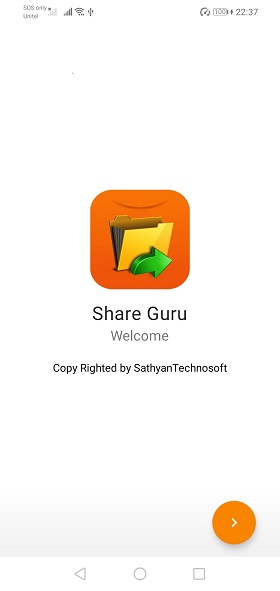
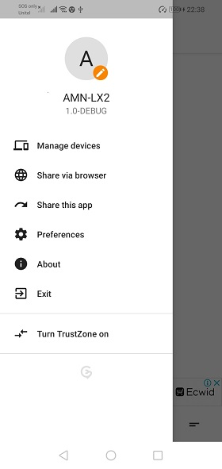
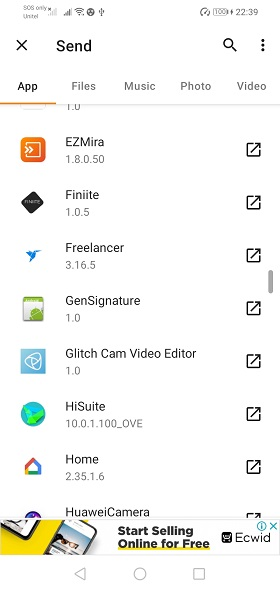
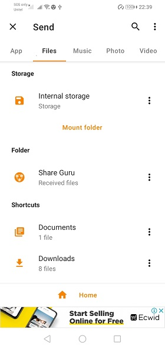
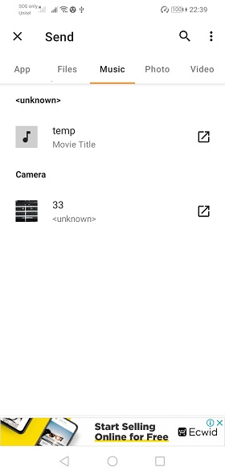

# Android file and text sharing app

## Main features
* Pause, resume and reconnect transfers
* Share large files
* Share all kinds of content, video, photo, music and app libraries
* No Internet connection is required: Set up a hotspot and connect to it using a QR code
* Share between multiple devices at the same time
* Exchange texts of any kind and save them to TrebleShot
* Share folders for backup and other purposes
* Light UI: Works faster than its rivals on low-end devices
* Speed-oriented: Minimal UI optimized for speed
* Advanced features: Network change handling, choose network based on measured speed

## Screenshot

|                Screenshot               |                 Screenshot            |               Screenshot              |
|:---------------------------------------:|:-------------------------------------:|:-------------------------------------:|
|    |      |    |

|                Screenshot               |                 Screenshot            |               Screenshot              |
|:---------------------------------------:|:-------------------------------------:|:-------------------------------------:|
|    |      |    |

This app is licensed under GNU Public License version 2.0 or later version.
